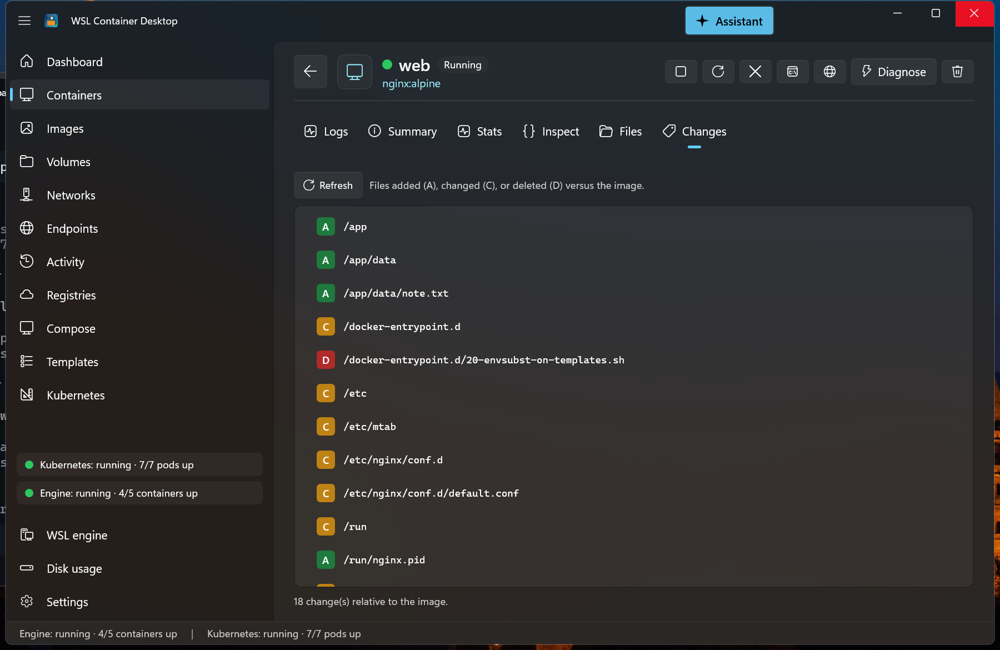
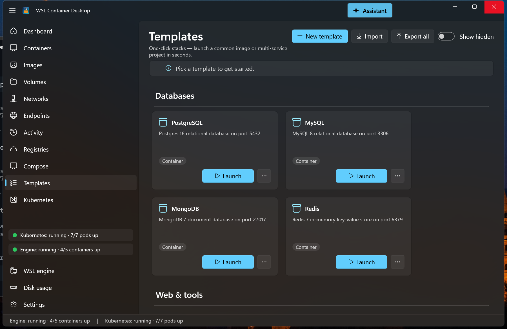
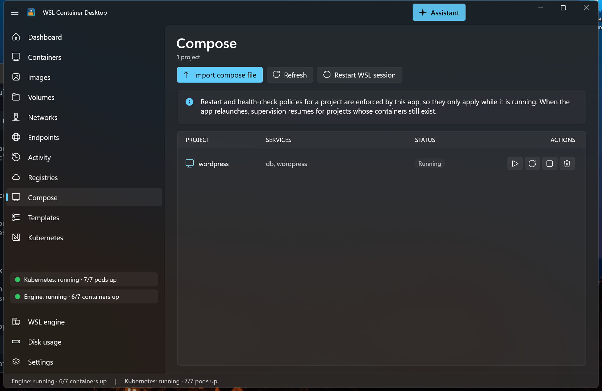
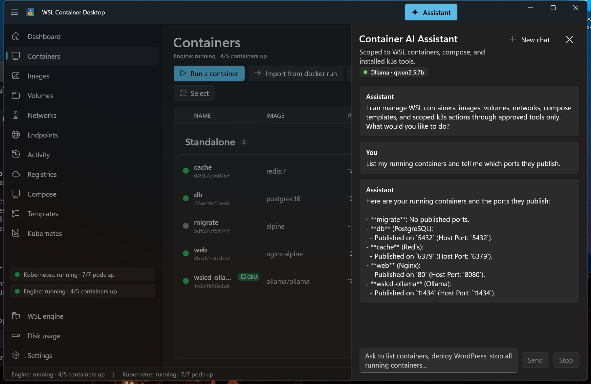
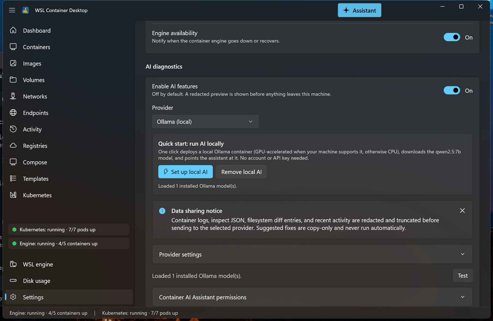
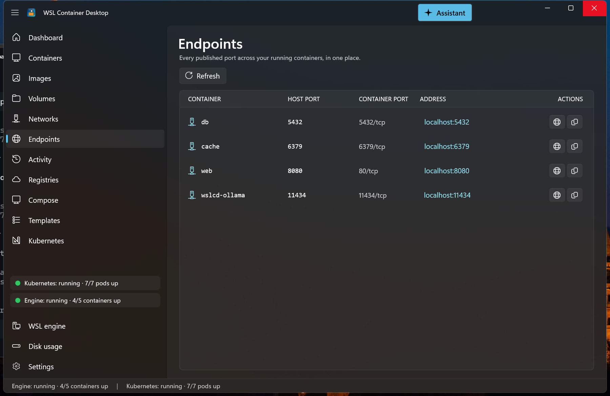
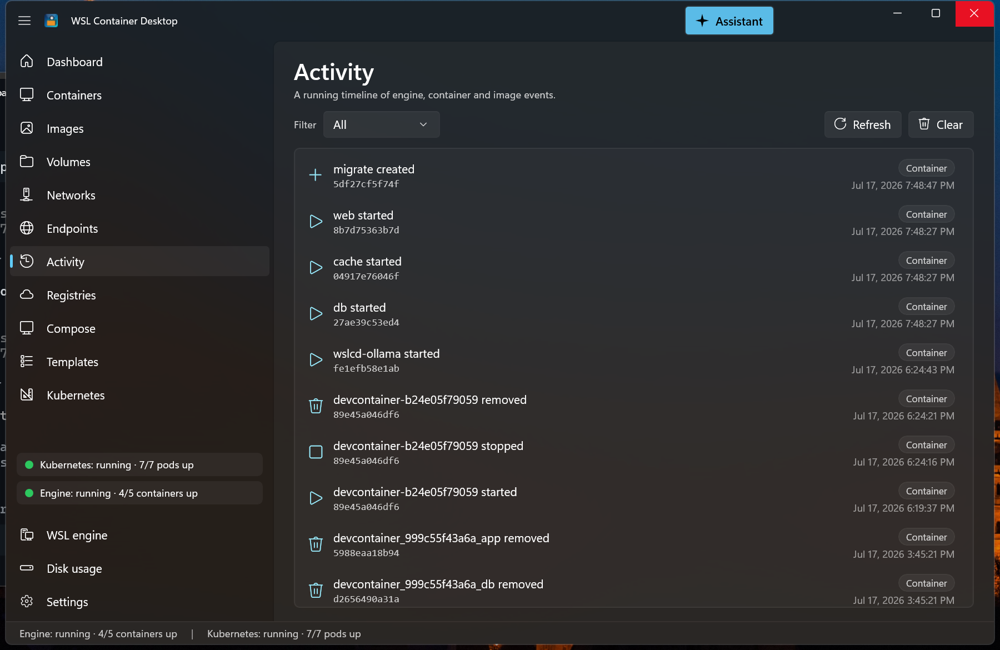
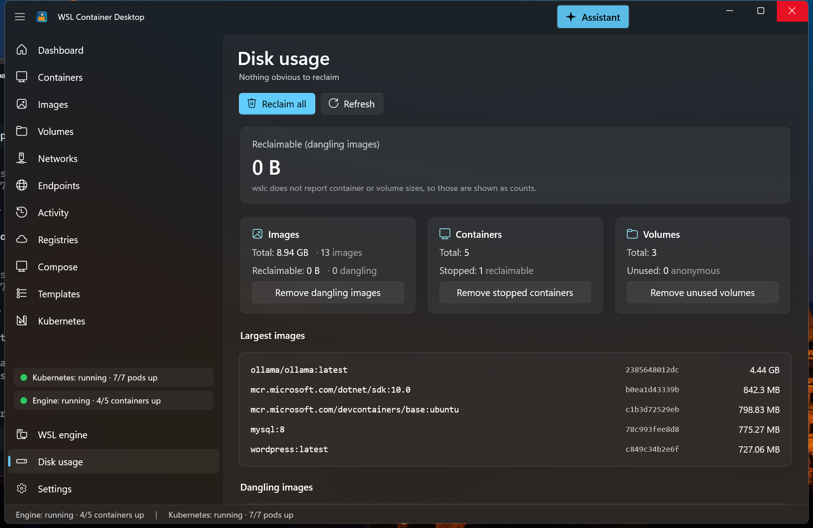
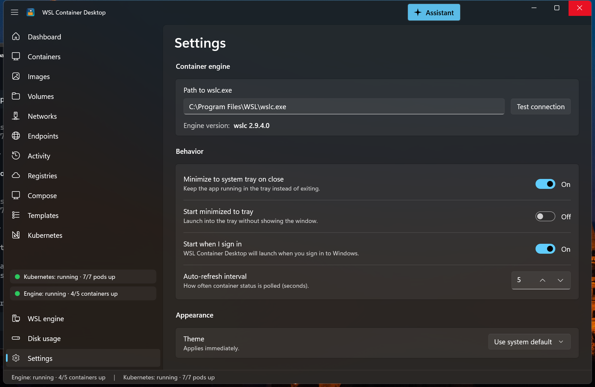

# WSL Container Desktop

A native **WinUI 3 / .NET 10** desktop application for managing **WSL containers** — the Linux container engine built into the Windows Subsystem for Linux (`wslc.exe`, public preview). It looks and feels like Docker Desktop or Podman Desktop, with a Fluent design, live performance metrics, a built-in Kubernetes (k3s) manager, container-registry management (including one-click Azure Container Registry sign-in), **optional AI diagnostics and an in-app assistant**, and a system-tray presence.

<p>
  
  
  
  
</p>

> [!IMPORTANT]
> **This is an independent, community project. It is not a Microsoft product**, and it is not affiliated with, endorsed by, or supported by Microsoft. See the [Disclaimer](#-disclaimer--no-warranty) below before you build or run it.

---

## Table of contents

- [Highlights](#highlights)
- [Screenshots](#screenshots)
- [Getting started](#getting-started)
- [Feature tour](#feature-tour)
- [Docker Compose compatibility](#docker-compose-compatibility)
- [Architecture](#architecture)
- [Notes on the WSL container preview](#notes-on-the-wsl-container-preview)
- [Disclaimer & no warranty](#-disclaimer--no-warranty)
- [License](#license)

---

## Highlights

- **Full container lifecycle** — run, start, stop, restart, kill, remove, prune, logs, exec terminal, inspect, and live stats.
- **Docker Compose** — import a `docker-compose.yml` and bring a whole multi-service stack **up / down / restart as a unit**, with dependency ordering, health/exit gating, and auto-heal. The desktop app acts as the orchestration layer above `wslc` — see [Docker Compose compatibility](#docker-compose-compatibility) for exactly what is and isn't supported.
- **Images, volumes, networks** — pull, build, tag, push, inspect, and prune, all from a clean Fluent UI.
- **Templates gallery** — a catalog of curated **one-click stacks** (databases, web tools, developer sandboxes, and multi-service Compose projects). **Launch** starts them immediately with sensible defaults; a per-card **Settings** button lets you configure first, and your choices are remembered for next time.
- **Image update badges** — **Check for updates** compares your local image digests against the registry and flags out-of-date images with an **↓ Update** badge, so you can pull the newer version in one click.
- **Endpoints dashboard** — every published port across all running containers in one list, with clickable `localhost` links that open in your browser or copy to the clipboard.
- **Bulk actions** — a **Select** mode on the Containers, Images, Volumes, and Networks lists lets you multi-select rows and start, stop, or remove many at once.
- **Activity feed** — a persisted, filterable timeline of engine, container, and image events (start/stop/create/remove, pull/build, engine up/down) so you can see what happened and when.
- **Built-in Kubernetes** — install a single-node **k3s** cluster into WSL and manage nodes, deployments, pods, services, and more, with port-forwarding and "Apply YAML".
- **AI assistant & diagnostics** *(optional, off by default)* — an in-app **Container AI Assistant** that manages containers, Compose, and k3s through approved, permissioned tools, plus one-click **Diagnose** on any container to explain failures and suggest fixes. Bring your own provider — **GitHub Copilot, Azure OpenAI, or any OpenAI-compatible endpoint** — or run **fully local with one click via Ollama** (no account, no API key). Container data is redacted and truncated before it leaves your machine, and suggested fixes are copy-only.
- **Registry management** — add public and private registries, and add an **Azure Container Registry with one click** using your existing Azure sign-in (no admin keys, tokens refreshed automatically).
- **Live everywhere** — a background monitor drives per-container performance meters, the tray icon, and the status indicators without you lifting a finger.
- **Lives in the tray** — minimize to a system-tray icon whose color reflects engine health, with a live running-container count and quick start/stop actions.
- **Toast notifications** — actionable Windows toasts for pull/build, container-stopped, and engine down/recovered events; user-toggleable and globally mutable.
- **Disk-usage & cleanup center** — see what images, containers, and volumes consume, what's reclaimable, and prune it all with one click.

---

## Screenshots

<p align="center">
  <br>
  <sub><b>Dashboard</b> — summary cards, a total-CPU meter, and a live per-container performance table.</sub>
</p>

<table>
  <tr>
    <td width="50%" valign="top">
      <br>
      <sub><b>Containers</b> — live, color-coded list with Compose grouping and inline actions; click any row for a full detail view.</sub>
    </td>
    <td width="50%" valign="top">
      <br>
      <sub><b>Filesystem changes</b> — a <code>docker diff</code>–style view of every file added, changed, or deleted versus the image.</sub>
    </td>
  </tr>
  <tr>
    <td width="50%" valign="top">
      <br>
      <sub><b>Templates</b> — one-click stacks for databases, web tools, developer sandboxes, and multi-service projects.</sub>
    </td>
    <td width="50%" valign="top">
      <br>
      <sub><b>Images</b> — pull, build, tag, push, inspect, and prune, with <b>update-available</b> badges.</sub>
    </td>
  </tr>
  <tr>
    <td width="50%" valign="top">
      <br>
      <sub><b>Docker Compose</b> — bring a whole multi-service stack up / down / restart as a unit, with dependency ordering and auto-heal.</sub>
    </td>
    <td width="50%" valign="top">
      <br>
      <sub><b>Kubernetes</b> — install and manage a single-node <b>k3s</b> cluster right inside the app, with a metrics dashboard and "Apply YAML".</sub>
    </td>
  </tr>
  <tr>
    <td width="50%" valign="top">
      <br>
      <sub><b>Container AI Assistant</b> <i>(optional)</i> — a permissioned, tool-calling chat that manages containers, Compose, and k3s; shown here answering a question via a fully local Ollama model.</sub>
    </td>
    <td width="50%" valign="top">
      <br>
      <sub><b>AI settings</b> <i>(opt-in)</i> — choose GitHub Copilot, Azure OpenAI, an OpenAI-compatible endpoint, or one-click local Ollama; container data is redacted before anything leaves your machine.</sub>
    </td>
  </tr>
</table>

<details>
<summary><b>📸 More screenshots</b> — container logs &amp; stats, endpoints, activity, registries, volumes, networks, Kubernetes deployments, disk usage, settings</summary>

<br>

<table>
  <tr>
    <td width="50%" valign="top">
      <br>
      <sub><b>Container logs</b> — live streaming output with search, filter, error highlighting, wrap, and export.</sub>
    </td>
    <td width="50%" valign="top">
      <br>
      <sub><b>Container stats</b> — live CPU and memory meters plus network I/O, block I/O, and PID count.</sub>
    </td>
  </tr>
  <tr>
    <td width="50%" valign="top">
      <br>
      <sub><b>Endpoints</b> — every published port across all running containers, with clickable <code>localhost</code> links.</sub>
    </td>
    <td width="50%" valign="top">
      <br>
      <sub><b>Activity</b> — a persisted, filterable timeline of engine, container, and image events.</sub>
    </td>
  </tr>
  <tr>
    <td width="50%" valign="top">
      <br>
      <sub><b>Registries</b> — manage public and private registries with a live login-status indicator and one-click <b>Add from Azure</b>.</sub>
    </td>
    <td width="50%" valign="top">
      <br>
      <sub><b>Kubernetes deployments</b> — a Podman-style resource explorer across nodes, deployments, pods, and services.</sub>
    </td>
  </tr>
  <tr>
    <td width="50%" valign="top">
      <br>
      <sub><b>Volumes</b> — create, inspect, remove, and prune named volumes.</sub>
    </td>
    <td width="50%" valign="top">
      <br>
      <sub><b>Networks</b> — list, create, inspect, remove, and prune, including the default <code>bridge</code>.</sub>
    </td>
  </tr>
  <tr>
    <td width="50%" valign="top">
      <br>
      <sub><b>Disk usage</b> — what images, containers, and volumes consume, what's reclaimable, and one-click <b>Reclaim all</b>.</sub>
    </td>
    <td width="50%" valign="top">
      <br>
      <sub><b>Settings</b> — point at <code>wslc.exe</code>, tune tray/startup behavior, toggle notifications per category, and switch theme.</sub>
    </td>
  </tr>
</table>

</details>

---

## Getting started

### Option A: Install a release (recommended for users)

Prebuilt, signed packages are published on the [**Releases**](https://github.com/mhackermsft/wslcontainerdesktop/releases) page.

1. Open the latest release and download **all three** assets into the same folder:
   - `WSLContainerDesktop_<version>_x64.msix` — the app (self-contained; it bundles the .NET and Windows App SDK runtimes).
   - `WSLContainerDesktop-Signing.cer` — the publisher certificate.
   - `Install.ps1` — the installer.
2. Right-click **`Install.ps1`** → **Run with PowerShell**. It requests admin rights, trusts the certificate, then installs the app.
3. Launch **WSL Container Desktop** from the Start menu.

To update later, download a newer release and run its `Install.ps1` the same way — it updates in place.

> [!NOTE]
> The package is **self-signed**. `Install.ps1` trusts the included certificate so Windows will accept it; you can inspect the `.cer` first (right-click → Open). You still need the **WSL container preview** (below) installed for the app to do anything.

### Option B: Build from source

#### 1. Prerequisites

| Requirement | Notes |
|-------------|-------|
| **Windows 11** | Required for WinUI 3 and the WSL container preview. |
| **WSL container preview** (`2.9.3+`) | Provides `wslc.exe` (default `C:\Program Files\WSL\wslc.exe`). |
| **.NET 10 SDK** | Needed to build and run from source. |
| **Windows App SDK** tooling | Installed with recent Visual Studio workloads. |
| **Azure CLI** *(optional)* | Only for the "Add from Azure" registry feature. |
| **AI provider** *(optional)* | Only for the AI assistant & diagnostics (off by default). Use **GitHub Copilot CLI** (signed in), an **Azure OpenAI** / **OpenAI-compatible** endpoint + API key, or run locally with **Ollama** (one-click **Set up local AI**). |
| **GPU** *(optional)* | Accelerates local Ollama inference; the app falls back to CPU automatically. |

Install or update the WSL container preview from an elevated PowerShell prompt:

```powershell
wsl --update --pre-release
```

Confirm the engine is present:

```powershell
& "C:\Program Files\WSL\wslc.exe" version
```

#### 2. Get the code

```powershell
git clone <your-fork-or-repo-url> wslcontainerdesktop
cd wslcontainerdesktop
```

> [!CAUTION]
> Before you build or run this, **review the source code yourself** to confirm it is safe and appropriate for your environment. You run it entirely at your own risk — see the [Disclaimer](#-disclaimer--no-warranty).

#### 3. Build & run

From a developer PowerShell prompt:

```powershell
cd src\WslContainerDesktop
dotnet run -c Debug -p:Platform=x64
```

Or open `WslContainerDesktop.slnx` in Visual Studio 2022/2026, select the **x64** platform, and press **F5**.

> [!NOTE]
> **Why `dotnet run` and not just `dotnet build`?**
> This is a packaged (MSIX-identity) WinUI app. `dotnet run` performs the full pipeline — build, refresh the packaged loose-layout, re-register the package, and launch. A plain `dotnet build` updates the binaries but leaves the *registered* app pointing at a stale layout, so you would keep launching the previous version.

#### Fast dev loop

`tools\launcher\Build-And-Run.ps1` rebuilds, redeploys, and launches the app in one step. A desktop shortcut named **WSL Container Desktop** points at it, so you can double-click to run the latest code after making changes.

### First run

1. Launch the app — the **Dashboard** shows your engine status and any running containers.
2. Head to **Images → Pull image** to fetch something (e.g. `nginx:alpine`).
3. Go to **Containers → Run a container**, pick the image, map a port, and click **Run**.
4. *(Optional)* Open **Kubernetes** and click **Install** to spin up a local k3s cluster.
5. *(Optional)* Open **Registries** to add a private registry or an Azure Container Registry.
6. *(Optional)* Open **Settings → AI diagnostics**, enable AI, and click **Set up local AI** to run a model locally — then use **Diagnose** on any container or the **Assistant** button in the title bar.

---

## Feature tour

### Dashboard
- Summary cards: **running / total containers**, **image count**, **volume count**, and **engine status** with version.
- A **Total CPU usage** meter across all containers.
- A **live performance table** of every running container — CPU %, memory, network I/O, and block I/O — refreshing continuously with inline progress bars.
- Status indicators for the container engine and the Kubernetes cluster, both in the nav footer and the bottom status bar.

### Containers
- Live list with color-coded state (green = running) and inline row actions.
- **Run a container** from a rich dialog: image, name, ports, environment variables, volumes, network, `--rm`, `-d`, `-i`, `--gpus all`, and a custom command. A **registry selector** qualifies bare image names.
- Start, Stop, Restart, Kill, Remove, and Prune stopped.
- **Health &amp; auto-heal** — configure a per-container health probe (an in-container **command** via `wslc exec`, or a host-side **TCP** connect to a published port) with a check interval and a restart policy. The watchdog enforces the policy, auto-restarts up to *N* times when a workload goes unhealthy, then stops and alerts. Health shows as a **badge** (healthy / degraded / down) on the list and rolls into the tray glyph, with a tray toast on unhealthy transitions. Config persists across restarts.
- Click a container for a **full-page detail view** with tabs:
  - **Logs** — live streaming output with auto-scroll and wrap toggle, plus **search** (with match count and next/previous navigation), **filter to matching lines only**, **error/warning highlighting**, **export to a text file**, and clear.
  - **Summary** — id, state, image, ports, IP, network, start time, command, env vars, and mounts.
  - **Stats** — live CPU and memory meters plus network I/O, block I/O, and process (PID) count.
  - **Inspect** — full raw JSON.
  - **Files** — browse the container filesystem, preview text files, upload/download via drag-and-drop, and create/rename/delete paths.
  - **Changes** — a `docker diff` equivalent listing every file **added (A)**, **changed (C)**, or **deleted (D)** relative to the container's image, so you can see exactly what a running container has written. (Emulated by comparing the container's rootfs against a fresh walk of its image; needs a running container with a shell.)
- Open an interactive terminal (`exec -it`) or open a published port in the browser.

### Docker Compose
- **Import a `docker-compose.yml`** (file picker) to create a **Compose project** — the app parses a large subset of the Compose spec into a service dependency graph.
- **Up / Down / Restart the whole stack as a unit** from the Compose page. On **up**, services start in dependency order with `depends_on` health/exit gating; project-scoped networks and named volumes are created (prefixed with the project name, like `docker compose`), and each service gets deterministic naming and Compose-style DNS aliases.
- **Auto-heal while the app runs** — `healthcheck` and `restart:` policies are enforced by the built-in watchdog. Because the desktop app *is* the orchestrator, **these features only work while WSL Container Desktop is running** (there is no background daemon).
- **Down** stops and removes the project's containers and networks but preserves volumes; **Remove** additionally deletes the volumes the project created (like `docker compose down --volumes`).
- Projects are **re-adopted on relaunch**, and the importer **warns about any unsupported keys** before you commit, so you always know what will and won't be honored.
- See [Docker Compose compatibility](#docker-compose-compatibility) for the full feature matrix.

### Images
- List with repository, tag, ID, size, and age.
- **Pull**, **Build** (from a Dockerfile + context), **Tag**, **Push**, **Inspect**, **Remove**, and **Prune**.
- **Check for updates** — compares each local image's digest against its registry and flags images that are behind with an **↓ Update** badge; pull the newer version straight from the row's **⋯** menu.
- Run a new container directly from an image.
- **Saved run profiles** — save an image's ports/env/volumes/network/name/flags as a reusable, named profile, prefill the Run dialog from one, and launch it in one click from the image's **⋯ → Run profile** menu. Profiles persist across restarts. (For full multi-service orchestration, use the [Docker Compose](#docker-compose) page instead.)
- Pull / Build / Push dialogs include a **registry selector** with a live "resolved reference" preview.

### Volumes
- Create, Inspect, Remove, and Prune.
- Enriched columns: **Name** (shortened for anonymous volumes), **Type** (Named vs Anonymous), **Used by**, and **Created**.
- Anonymous volumes are correlated back to the container that created them.

### Networks
- List, Create, Inspect, Remove, and Prune, including the default `bridge` network.

### Endpoints
- A unified, at-a-glance view of **every published port across all running containers** in one place, reachable from the **Endpoints** entry in the navigation pane.
- Each row shows the container, host port, container port/protocol, and a clickable **`localhost:<port>`** address that **opens in your browser** (for TCP endpoints) or can be **copied** to the clipboard.
- Updates live from the same engine poll as the dashboard and tray.

### Activity
- A persisted **timeline of engine, container, and image events**, reachable from the **Activity** entry in the navigation pane.
- Captures **container lifecycle** (created / started / stopped / removed) and **engine up/down** from the background monitor, plus **image pull/build** outcomes (successes and failures) recorded directly — independent of your toast-notification settings.
- **Filter** by category (All / Engine / Container / Image); each entry shows an icon, title, optional detail (short id or error), a category chip, and an **absolute date &amp; time**.
- Events **persist to disk** (a rolling 500-event log) so the timeline survives restarts; **Clear** empties it.

### Bulk actions
- The **Containers**, **Images**, **Volumes**, and **Networks** lists have a **Select** toggle that turns on multi-select checkboxes and swaps the toolbar for a bulk-action bar showing the selected count.
- Select several rows and act on them together: **Start / Stop / Remove** on Containers, and **Remove** on Images, Volumes, and Networks (built-in networks are skipped). **Cancel** exits Select mode.

### Disk usage
- A holistic **disk-usage & cleanup center**, reachable from the **Disk usage** entry at the bottom of the navigation pane (next to Settings), that summarizes how much space **images**, **containers**, and **volumes** consume and how much is reclaimable.
- Lists the **largest images**, **dangling images**, and **unused (orphaned anonymous) volumes**.
- **One-click prune** for dangling images, stopped containers, and unused volumes — or **Reclaim all** at once — each with an explicit confirmation and before/after freed-space feedback. Reuses the existing per-resource prune commands.

### Registries
- A managed list of container registries used by the Run / Pull / Build / Push dialogs, with **Docker Hub** built in as the default.
- **Add registry** — register any public or private registry by host, with optional sign-in.
- **Add from Azure** — a guided wizard that verifies the Azure CLI, signs you in, lists your subscriptions and Azure Container Registries, and adds the one you pick. It authenticates using your **Azure identity** (a short-lived token via `az acr login --expose-token`), so **no admin username, password, or key is required**.
- **Live login status** per registry, with tokens for Azure registries **refreshed automatically** in the background and just-in-time before an app-initiated pull, run, or push.
- Credentials are handed to the container engine's own credential store — the app never persists your passwords.

### Templates
- A gallery of curated **one-click stacks**, reachable from the **Templates** entry in the navigation pane, grouped into **Databases** (PostgreSQL, MySQL, MongoDB, Redis), **Web &amp; tools** (Nginx, Adminer, MinIO, RabbitMQ), **Developer** sandboxes, and multi-service **Stacks**.
- **Launch** starts a template **immediately with sensible defaults — no dialog**. If a container from a previous launch already exists, Launch offers to **replace** it with the current configuration (data in named volumes is preserved).
- A per-card **⚙️ Settings** button lets you **configure before starting**: single-container templates open the full **Run a container** dialog prefilled; Compose stacks open an editable **project name + YAML** editor. Saving both **starts the template and remembers your configuration**, so the next Launch reuses it. Saved configs persist across restarts (`template-configs.json`).
- **Developer sandboxes** — keep-alive **Python, Node.js, .NET SDK, Java, Go, and Rust** environments (latest supported versions) with a persistent `/workspace` volume; open the container's **Terminal** action for a shell.
- **Compose stacks** — templates like **WordPress + MySQL** and **PostgreSQL + pgAdmin** are imported and brought up as a multi-service project in one click.

### Kubernetes
- **Install / uninstall** a single-node **k3s** cluster inside your WSL distro, with streaming progress.
- **Start / Stop** the cluster and **Upgrade** it to the latest stable or a specific version (with a version-skew guard that steps one minor version at a time).
- A **metrics dashboard** and a Podman-style resource explorer for Nodes, Deployments, Pods, Services, Ingresses, PVCs, ConfigMaps, Secrets, Jobs, and CronJobs.
- **Row quick actions** (scale, restart, run-now, delete) and a **full detail view** per object with Summary / **Kube** (editable YAML you can apply back) / Describe / Logs tabs.
- **Apply YAML** manifests and **port-forward** services or pods to `localhost`.

### AI features *(optional — off by default)*
AI is entirely opt-in: nothing is enabled, and **no data leaves your machine**, until you turn it on in **Settings → AI diagnostics** and pick a provider.

- **Choose your provider** — **GitHub Copilot** (uses your Copilot CLI sign-in), **Azure OpenAI**, any **OpenAI-compatible** endpoint, or **Ollama** for fully local inference. API keys are stored in **Windows Credential Manager**, never in plain text.
- **One-click local AI** — **Set up local AI** deploys an Ollama container (GPU-accelerated when your hardware supports it, otherwise CPU), pulls a default model (`qwen2.5:7b`), and points the app at it — no account or API key required.
- **Diagnose-and-fix** — a **Diagnose** button on any container's detail view gathers its logs, inspect JSON, filesystem-diff entries, and recent activity, **redacts and truncates** them into a preview you can review first, then asks the model what went wrong and how to fix it. Suggested fixes are **copy-only and never run automatically**.
- **Container AI Assistant** — a side-panel chat that can actually *do* things through a scoped, permissioned toolset: list/run/stop containers, deploy Compose templates, and take scoped k3s actions. **Read-only tools run automatically; anything that changes state prompts for approval** (per-tool auto-approve is configurable), so you stay in control.
- **Privacy by design** — everything sent to a provider is redacted and truncated first, a data-sharing notice spells out exactly what is shared, and local (Ollama) mode keeps all inference on your machine.

### Notifications
- **Windows toast notifications** for noteworthy events: image pull/build completed or failed, a container that stopped running, and the engine going down or recovering.
- **Clicking a toast** activates the app and opens the relevant page.
- **User-toggleable** in Settings — a master *Show notifications* switch plus per-category switches (images, containers, engine) — and globally mutable from the tray menu.

### System tray
- Minimizes / closes to the tray instead of exiting (configurable).
- **Right-click menu**: open the app, a live status line, the **running-container count**, **quick start/stop** for each container, a **Mute notifications** toggle, and Quit.
- Tray icon color reflects engine health — **green = healthy**, amber = a container is unhealthy/degraded, red = engine unreachable or a container is down.
- **Balloon notifications** when a watched container transitions to unhealthy or down.

### Settings
- Path to `wslc.exe` with a **Test connection** button and engine version readout.
- Close-to-tray and start-minimized toggles.
- **Notification toggles** — master switch plus per-category (images, containers, engine).
- Auto-refresh interval.
- **AI diagnostics** *(off by default)* — enable AI, choose a provider (GitHub Copilot / Azure OpenAI / OpenAI-compatible / local Ollama), set up local AI in one click, and configure per-tool Assistant permissions.
- Light / Dark / System theme, applied instantly.

---

## Docker Compose compatibility

WSL Container Desktop can import a `docker-compose.yml` and run the whole stack, but it is **not** a drop-in replacement for the `docker compose` CLI. Understanding the model below will tell you what to expect.

### Purpose & model — "desktop-as-daemon"

The WSL container engine (`wslc`) has no built-in Compose command and no long-running orchestration daemon. To offer fuller Compose support, **WSL Container Desktop itself acts as the orchestration layer above `wslc`**: it parses the Compose file, resolves the dependency graph, and translates each service into `wslc run` (and `network`/`volume`) commands, then supervises the result.

The single most important consequence:

> [!IMPORTANT]
> **Anything that requires ongoing supervision only works while WSL Container Desktop is running.** Health checks, restart policies, and auto-heal are enforced by the app's in-process watchdog — there is no background service. If you close the app, your containers keep running, but they will **not** be health-checked or auto-restarted until you reopen it. This is by design: it is a desktop tool, not a server-grade orchestrator.

This makes it ideal for **local development and testing** of multi-container apps — spin a stack up, iterate, tear it down — rather than for unattended production hosting.

### What works

A large subset of the Compose spec is honored on **up**:

- **Services** — `image`, `build` (context/dockerfile/args/target/labels/pull), `container_name`, `command`, `entrypoint`, `user`, `working_dir`, `hostname`, `labels`.
- **Networking & storage** — `ports` (short and long form), `volumes` (short and long form), top-level `networks:` / `volumes:` creation, service DNS aliases, `secrets:` / `configs:` (file-backed, best-effort), `extra_hosts` (best-effort), `tmpfs`, `dns*`.
- **Config** — `environment`, `env_file`, `${VAR}` / `${VAR:-default}` interpolation, YAML anchors/aliases, `<<` merge keys, block scalars, `extends:`, `include:`, and a sibling `docker-compose.override.yml` (deep-merged).
- **Resources** — `deploy.resources.limits.{cpus,memory}`, `cpus`, `mem_limit`, `ulimits`, `shm_size`, `stop_signal`, `stop_grace_period`.
- **Lifecycle** — `depends_on` (including `condition: service_healthy` / `service_completed_successfully`), `healthcheck`, `restart:` (`no`/`always`/`on-failure`/`unless-stopped`), `profiles:`, and project `up` / `down` / `restart` with re-adoption on relaunch.

Some of these are **best-effort** — e.g. `secrets`/`configs` are bind-mounted rather than stored in an engine secret store, `extra_hosts` is applied via `exec` after start, and `restart` backoff timing is not byte-for-byte identical to Docker.

### What is *not* supported

Features with no matching `wslc` capability or that require a persistent daemon are **skipped** (the importer warns you about them before the project is saved):

- **Multi-network attach per container** — `wslc run` attaches only the *first* network; there is no `network connect`.
- **Low-level container options** — `cap_add` / `cap_drop`, `devices`, `sysctls`, `privileged`, `read_only`, `init`, `pid` / `ipc`, `mac_address`, and `logging` drivers.
- **Scaling & Swarm** — `deploy.replicas` / scaling and the rest of Swarm-mode `deploy`.
- **Always-on restart after the app closes** — see the model note above.

For the authoritative, line-by-line feature matrix (including exactly how each key is mapped), see the **Compose feature support** table in [`docs/ARCHITECTURE.md`](docs/ARCHITECTURE.md#compose-feature-support).

---

## Architecture

MVVM (CommunityToolkit.Mvvm) with dependency injection (Microsoft.Extensions.DependencyInjection).

| Layer | Responsibility |
|-------|----------------|
| `Services/WslcService` | Wraps `wslc.exe`, parses `--format json` output into typed models |
| `Services/KubernetesService` | Manages a k3s cluster via `wsl.exe -u root` (install, resources, port-forward) |
| `Services/AzureCliService` | Discovers and authenticates to Azure Container Registries via `az` |
| `Services/RegistryAuthRefresher` | Keeps Azure-backed registry logins fresh (background + just-in-time) |
| `Services/ProcessRunner` | Async process execution + interactive console launches |
| `Services/StatusMonitor` | Background poller and single source of truth for engine, Kubernetes, and registry health |
| `Services/ContainerAssistantService` | The AI assistant's tool-calling loop over a pluggable `IAiChatProvider` (Copilot / Azure OpenAI / OpenAI-compatible / Ollama), with per-tool permissions |
| `Services/SettingsService` | JSON settings persisted under `%LOCALAPPDATA%` |
| `Tray/TrayIcon` | Win32 `Shell_NotifyIcon` tray with a GDI+ status-dot icon and popup menu |
| `ViewModels/*` | Observable state and commands |
| `Views/*`, `Dialogs/*` | WinUI 3 pages and dialogs |

The tray is implemented directly against Win32 (`Shell_NotifyIcon`, a hidden message window, `TrackPopupMenuEx`) so it has no third-party UI dependencies and stays compatible with the latest Windows App SDK.

For a deeper contributor-oriented walkthrough — the process-execution strategy, the `StatusMonitor` model, the k3s status marker protocol, the installer trust model, and coding conventions — see [`docs/ARCHITECTURE.md`](docs/ARCHITECTURE.md).

---

## Releasing (maintainers)

Releases are cut by manually running the **Build & Release (MSIX)** workflow:

1. Go to **Actions → Build & Release (MSIX) → Run workflow**.
2. Enter a **version** (SemVer `X.Y.Z`, e.g. `1.2.0`). Leave it blank to auto-derive `0.1.<run-number>`. Optionally tick **pre-release**.
3. The workflow stamps the version into the package manifest, builds a **self-contained** MSIX (x64), signs it with the repository's signing certificate, and publishes a GitHub Release tagged `v<version>` with the `.msix`, the `.cer`, and `Install.ps1` attached.

**Versioning:** the version you supply becomes the MSIX identity version `X.Y.Z.0` and the app's displayed version (read at runtime from the package identity, so it always matches the installed build). Bump it each release — the workflow refuses to reuse an existing tag, and Windows only treats a package as an in-place update when the version increases. The manifest version committed in source is just a placeholder; the release version overrides it at build time.

Signing details and how to rotate the certificate are documented in [`build/README-signing.md`](build/README-signing.md).

---

## Notes on the WSL container preview

`wslc` mirrors the Docker CLI, so commands map cleanly (`list`, `images`, `run`, `pull`, `push`, `logs`, `exec`, `stats`, `volume`, `network`, `build`, `login`, …). A few preview-specific details this app accounts for:

- Container state integers from `wslc list --format json` map as `1 = Created`, `2 = Running`, `3 = Stopped`.
- `prune` subcommands do **not** accept `--force`; `volume prune` needs `--all` to include named volumes.
- `wslc inspect` does not currently report named-volume mounts, so a volume-to-container mapping is only possible for anonymous (image-declared) volumes.
- There is no `pause` command; **Kill** serves as a force-stop.

These are limitations of the current public preview and will light up automatically as `wslc` fills the gaps.

---

## ⚠️ Disclaimer & no warranty

**This project is not a Microsoft product.** It is an independent, community-developed application and is **not affiliated with, endorsed by, sponsored by, or supported by Microsoft Corporation**. "Windows", "WSL", "Azure", and related marks are trademarks of Microsoft; they are used here only to describe interoperability.

**There is no support, no guarantee, and no warranty of any kind.** This software is provided **"AS IS"**, without warranty of any kind, express or implied, including but not limited to the warranties of merchantability, fitness for a particular purpose, title, and non-infringement.

- **You are responsible for reviewing the source code** to determine whether it is safe, secure, and suitable for your needs before building, installing, or running it.
- The authors and contributors provide **no support** and make **no guarantees** about functionality, security, reliability, or fitness for any purpose.
- The authors and contributors are **not responsible or liable for any damages** — direct, indirect, incidental, special, consequential, or otherwise — arising from the use, misuse, or inability to use this application, including but not limited to data loss, container or cluster changes, credential handling, or any impact on your systems or cloud resources.
- This application executes commands against your local container engine, your WSL distributions, and — if you use the Azure features — your Azure subscriptions. **Understand what it does before you run it**, and use it only in environments where you accept that risk.

By building, installing, or running this software, you acknowledge and accept these terms. If you do not accept them, do not use this software.

---

## License

This project is licensed under the **GNU General Public License v3.0** — see the [LICENSE](LICENSE) file for the full text.

In short: you are free to use, study, modify, and share this software. If you distribute it — modified or not — you must make your version's complete source code available under the same GPLv3 terms. This keeps the project and any derivatives open; it prevents anyone from taking the code, making changes, and shipping it as a closed-source or proprietary commercial product. The GPLv3 also includes its own disclaimer of warranty and limitation of liability, which apply in addition to the [Disclaimer](#-disclaimer--no-warranty) above.
