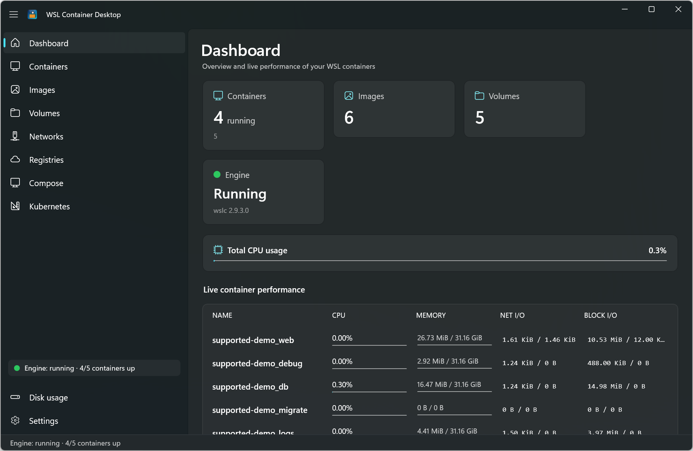
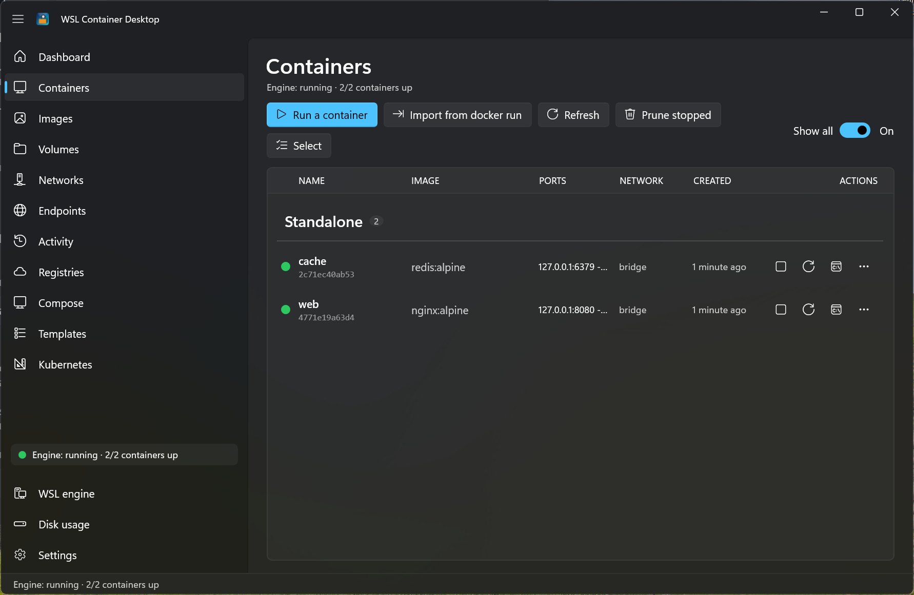
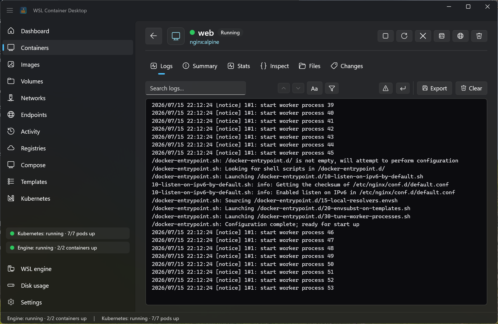
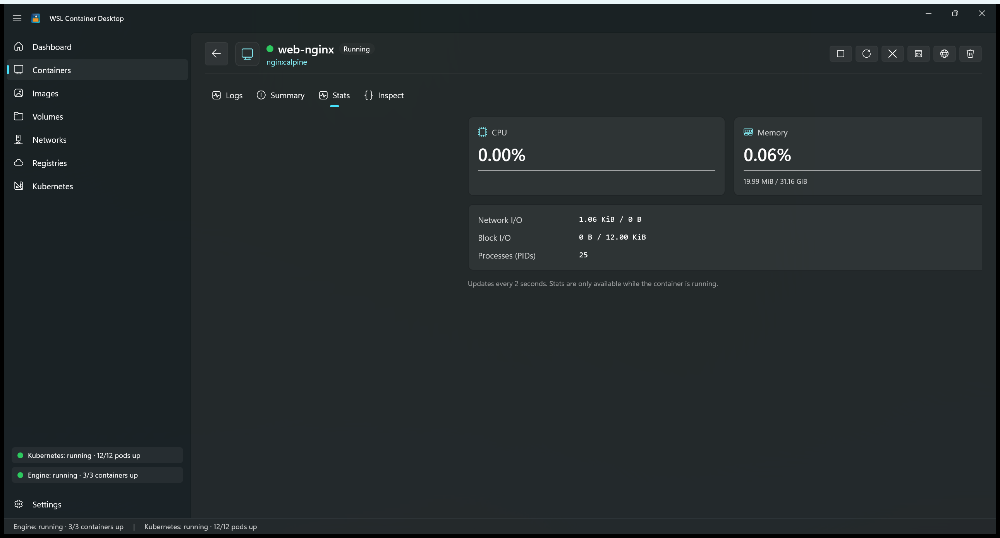
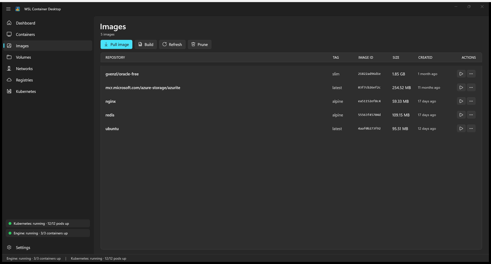
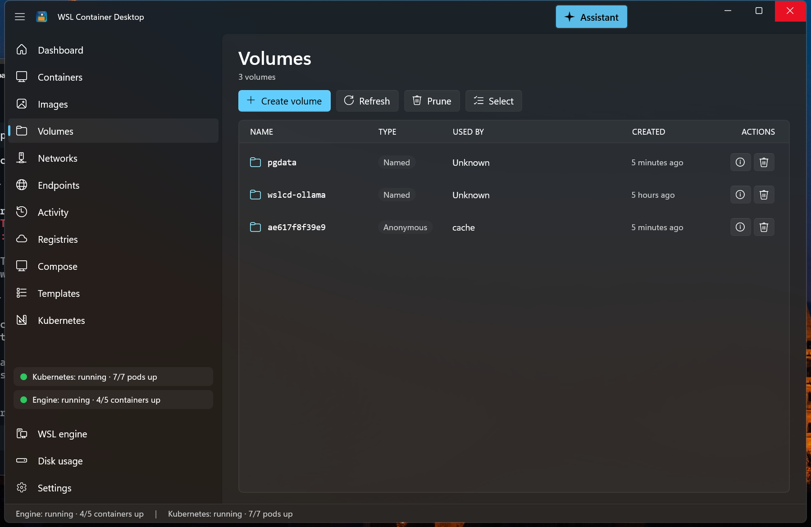
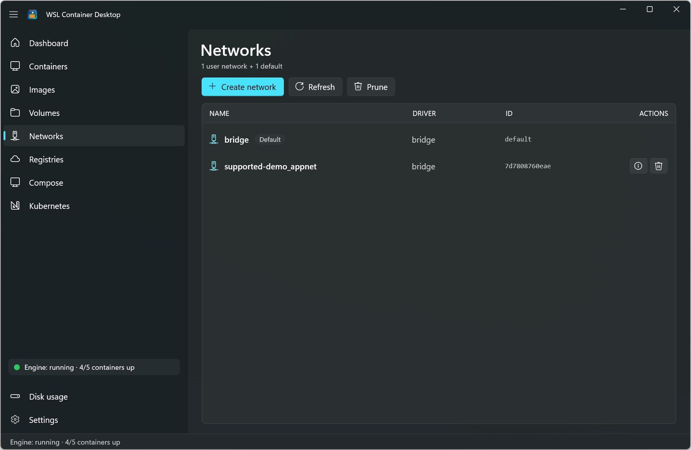
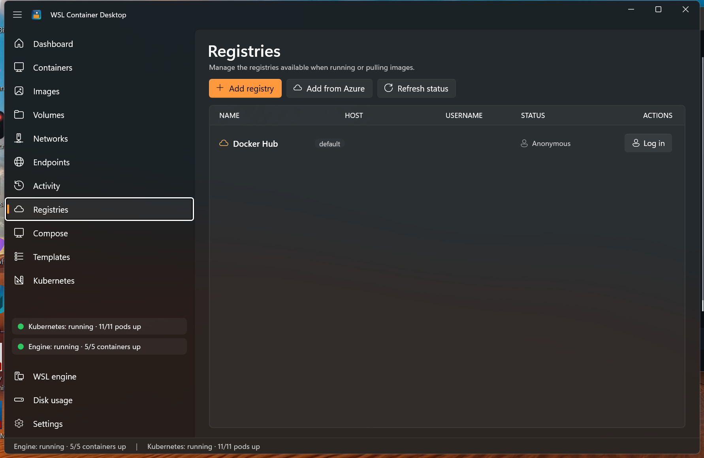
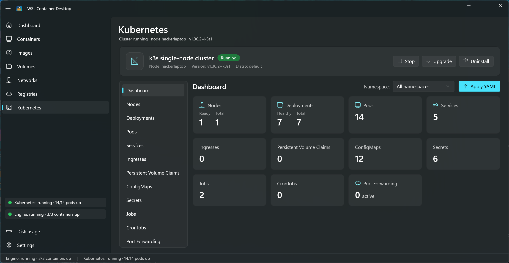
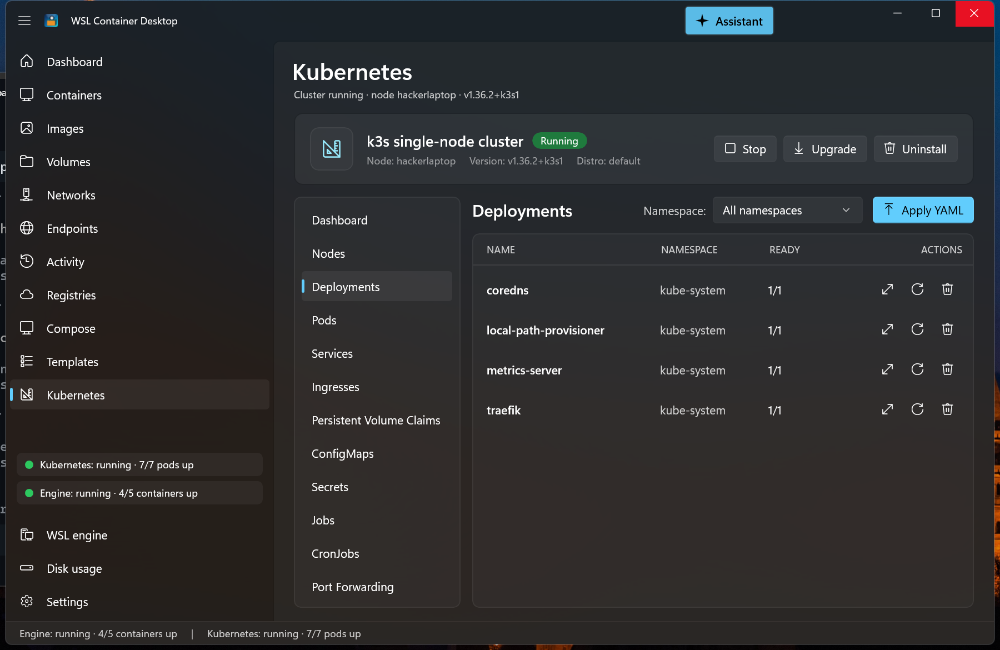

# WSL Container Desktop

A native **WinUI 3 / .NET 10** desktop application for managing **WSL containers** — the Linux container engine built into the Windows Subsystem for Linux (`wslc.exe`, public preview). It looks and feels like Docker Desktop or Podman Desktop, with a Fluent design, live performance metrics, a built-in Kubernetes (k3s) manager, container-registry management (including one-click Azure Container Registry sign-in), and a system-tray presence.

<p>
  
  
  
  
</p>

> [!IMPORTANT]
> **This is an independent, community project. It is not a Microsoft product**, and it is not affiliated with, endorsed by, or supported by Microsoft. See the [Disclaimer](#-disclaimer--no-warranty) below before you build or run it.

---

## Table of contents

- [Highlights](#highlights)
- [Screenshots](#screenshots)
- [Getting started](#getting-started)
- [Feature tour](#feature-tour)
- [Architecture](#architecture)
- [Notes on the WSL container preview](#notes-on-the-wsl-container-preview)
- [Disclaimer & no warranty](#-disclaimer--no-warranty)
- [License](#license)

---

## Highlights

- **Full container lifecycle** — run, start, stop, restart, kill, remove, prune, logs, exec terminal, inspect, and live stats.
- **Images, volumes, networks** — pull, build, tag, push, inspect, and prune, all from a clean Fluent UI.
- **Built-in Kubernetes** — install a single-node **k3s** cluster into WSL and manage nodes, deployments, pods, services, and more, with port-forwarding and "Apply YAML".
- **Registry management** — add public and private registries, and add an **Azure Container Registry with one click** using your existing Azure sign-in (no admin keys, tokens refreshed automatically).
- **Live everywhere** — a background monitor drives per-container performance meters, the tray icon, and the status indicators without you lifting a finger.
- **Lives in the tray** — minimize to a system-tray icon whose color reflects engine health.

---

## Screenshots

### Dashboard
An at-a-glance overview with summary cards, a total-CPU meter, and a live per-container performance table.



### Containers
A live list with color-coded state and inline actions. Click any row for a full detail view.



Container detail — **live logs** and a **Stats** tab (CPU, memory, network / block I/O, PIDs):




### Images, Volumes & Networks





### Registries
Manage the registries available when running or pulling images — with a live login-status indicator and one-click **Add from Azure**.



### Kubernetes
Install and manage a single-node **k3s** cluster right inside the app: a metrics dashboard, a Podman-style resource explorer, "Apply YAML", and port forwarding.




---

## Getting started

### 1. Prerequisites

| Requirement | Notes |
|-------------|-------|
| **Windows 11** | Required for WinUI 3 and the WSL container preview. |
| **WSL container preview** (`2.9.3+`) | Provides `wslc.exe` (default `C:\Program Files\WSL\wslc.exe`). |
| **.NET 10 SDK** | Needed to build and run from source. |
| **Windows App SDK** tooling | Installed with recent Visual Studio workloads. |
| **Azure CLI** *(optional)* | Only for the "Add from Azure" registry feature. |

Install or update the WSL container preview from an elevated PowerShell prompt:

```powershell
wsl --update --pre-release
```

Confirm the engine is present:

```powershell
& "C:\Program Files\WSL\wslc.exe" version
```

### 2. Get the code

```powershell
git clone <your-fork-or-repo-url> wslcontainerdesktop
cd wslcontainerdesktop
```

> [!CAUTION]
> Before you build or run this, **review the source code yourself** to confirm it is safe and appropriate for your environment. You run it entirely at your own risk — see the [Disclaimer](#-disclaimer--no-warranty).

### 3. Build & run

From a developer PowerShell prompt:

```powershell
cd src\WslContainerDesktop
dotnet run -c Debug -p:Platform=x64
```

Or open `WslContainerDesktop.slnx` in Visual Studio 2022/2026, select the **x64** platform, and press **F5**.

> [!NOTE]
> **Why `dotnet run` and not just `dotnet build`?**
> This is a packaged (MSIX-identity) WinUI app. `dotnet run` performs the full pipeline — build, refresh the packaged loose-layout, re-register the package, and launch. A plain `dotnet build` updates the binaries but leaves the *registered* app pointing at a stale layout, so you would keep launching the previous version.

#### Fast dev loop

`tools\launcher\Build-And-Run.ps1` rebuilds, redeploys, and launches the app in one step. A desktop shortcut named **WSL Container Desktop** points at it, so you can double-click to run the latest code after making changes.

### 4. First run

1. Launch the app — the **Dashboard** shows your engine status and any running containers.
2. Head to **Images → Pull image** to fetch something (e.g. `nginx:alpine`).
3. Go to **Containers → Run a container**, pick the image, map a port, and click **Run**.
4. *(Optional)* Open **Kubernetes** and click **Install** to spin up a local k3s cluster.
5. *(Optional)* Open **Registries** to add a private registry or an Azure Container Registry.

---

## Feature tour

### Dashboard
- Summary cards: **running / total containers**, **image count**, **volume count**, and **engine status** with version.
- A **Total CPU usage** meter across all containers.
- A **live performance table** of every running container — CPU %, memory, network I/O, and block I/O — refreshing continuously with inline progress bars.
- Status indicators for the container engine and the Kubernetes cluster, both in the nav footer and the bottom status bar.

### Containers
- Live list with color-coded state (green = running) and inline row actions.
- **Run a container** from a rich dialog: image, name, ports, environment variables, volumes, network, `--rm`, `-d`, `-i`, `--gpus all`, and a custom command. A **registry selector** qualifies bare image names.
- Start, Stop, Restart, Kill, Remove, and Prune stopped.
- Click a container for a **full-page detail view** with tabs:
  - **Logs** — live streaming output with auto-scroll, wrap toggle, and clear.
  - **Summary** — id, state, image, ports, IP, network, start time, command, env vars, and mounts.
  - **Stats** — live CPU and memory meters plus network I/O, block I/O, and process (PID) count.
  - **Inspect** — full raw JSON.
- Open an interactive terminal (`exec -it`) or open a published port in the browser.

### Images
- List with repository, tag, ID, size, and age.
- **Pull**, **Build** (from a Dockerfile + context), **Tag**, **Push**, **Inspect**, **Remove**, and **Prune**.
- Run a new container directly from an image.
- Pull / Build / Push dialogs include a **registry selector** with a live "resolved reference" preview.

### Volumes
- Create, Inspect, Remove, and Prune.
- Enriched columns: **Name** (shortened for anonymous volumes), **Type** (Named vs Anonymous), **Used by**, and **Created**.
- Anonymous volumes are correlated back to the container that created them.

### Networks
- List, Create, Inspect, Remove, and Prune, including the default `bridge` network.

### Registries
- A managed list of container registries used by the Run / Pull / Build / Push dialogs, with **Docker Hub** built in as the default.
- **Add registry** — register any public or private registry by host, with optional sign-in.
- **Add from Azure** — a guided wizard that verifies the Azure CLI, signs you in, lists your subscriptions and Azure Container Registries, and adds the one you pick. It authenticates using your **Azure identity** (a short-lived token via `az acr login --expose-token`), so **no admin username, password, or key is required**.
- **Live login status** per registry, with tokens for Azure registries **refreshed automatically** in the background and just-in-time before an app-initiated pull, run, or push.
- Credentials are handed to the container engine's own credential store — the app never persists your passwords.

### Kubernetes
- **Install / uninstall** a single-node **k3s** cluster inside your WSL distro, with streaming progress.
- **Start / Stop** the cluster and **Upgrade** it to the latest stable or a specific version (with a version-skew guard that steps one minor version at a time).
- A **metrics dashboard** and a Podman-style resource explorer for Nodes, Deployments, Pods, Services, Ingresses, PVCs, ConfigMaps, Secrets, Jobs, and CronJobs.
- **Row quick actions** (scale, restart, run-now, delete) and a **full detail view** per object with Summary / **Kube** (editable YAML you can apply back) / Describe / Logs tabs.
- **Apply YAML** manifests and **port-forward** services or pods to `localhost`.

### System tray
- Minimizes / closes to the tray instead of exiting (configurable).
- **Right-click menu**: open the app, a live status line, and Quit.
- Tray icon color reflects engine health — **green = healthy**, red = unreachable.

### Settings
- Path to `wslc.exe` with a **Test connection** button and engine version readout.
- Close-to-tray and start-minimized toggles.
- Auto-refresh interval.
- Light / Dark / System theme, applied instantly.

---

## Architecture

MVVM (CommunityToolkit.Mvvm) with dependency injection (Microsoft.Extensions.DependencyInjection).

| Layer | Responsibility |
|-------|----------------|
| `Services/WslcService` | Wraps `wslc.exe`, parses `--format json` output into typed models |
| `Services/KubernetesService` | Manages a k3s cluster via `wsl.exe -u root` (install, resources, port-forward) |
| `Services/AzureCliService` | Discovers and authenticates to Azure Container Registries via `az` |
| `Services/RegistryAuthRefresher` | Keeps Azure-backed registry logins fresh (background + just-in-time) |
| `Services/ProcessRunner` | Async process execution + interactive console launches |
| `Services/StatusMonitor` | Background poller and single source of truth for engine, Kubernetes, and registry health |
| `Services/SettingsService` | JSON settings persisted under `%LOCALAPPDATA%` |
| `Tray/TrayIcon` | Win32 `Shell_NotifyIcon` tray with a GDI+ status-dot icon and popup menu |
| `ViewModels/*` | Observable state and commands |
| `Views/*`, `Dialogs/*` | WinUI 3 pages and dialogs |

The tray is implemented directly against Win32 (`Shell_NotifyIcon`, a hidden message window, `TrackPopupMenuEx`) so it has no third-party UI dependencies and stays compatible with the latest Windows App SDK.

For a deeper contributor-oriented walkthrough — the process-execution strategy, the `StatusMonitor` model, the k3s status marker protocol, the installer trust model, and coding conventions — see [`docs/ARCHITECTURE.md`](docs/ARCHITECTURE.md).

---

## Notes on the WSL container preview

`wslc` mirrors the Docker CLI, so commands map cleanly (`list`, `images`, `run`, `pull`, `push`, `logs`, `exec`, `stats`, `volume`, `network`, `build`, `login`, …). A few preview-specific details this app accounts for:

- Container state integers from `wslc list --format json` map as `1 = Created`, `2 = Running`, `3 = Stopped`.
- `prune` subcommands do **not** accept `--force`; `volume prune` needs `--all` to include named volumes.
- `wslc inspect` does not currently report named-volume mounts, so a volume-to-container mapping is only possible for anonymous (image-declared) volumes.
- There is no `pause` command; **Kill** serves as a force-stop.

These are limitations of the current public preview and will light up automatically as `wslc` fills the gaps.

---

## ⚠️ Disclaimer & no warranty

**This project is not a Microsoft product.** It is an independent, community-developed application and is **not affiliated with, endorsed by, sponsored by, or supported by Microsoft Corporation**. "Windows", "WSL", "Azure", and related marks are trademarks of Microsoft; they are used here only to describe interoperability.

**There is no support, no guarantee, and no warranty of any kind.** This software is provided **"AS IS"**, without warranty of any kind, express or implied, including but not limited to the warranties of merchantability, fitness for a particular purpose, title, and non-infringement.

- **You are responsible for reviewing the source code** to determine whether it is safe, secure, and suitable for your needs before building, installing, or running it.
- The authors and contributors provide **no support** and make **no guarantees** about functionality, security, reliability, or fitness for any purpose.
- The authors and contributors are **not responsible or liable for any damages** — direct, indirect, incidental, special, consequential, or otherwise — arising from the use, misuse, or inability to use this application, including but not limited to data loss, container or cluster changes, credential handling, or any impact on your systems or cloud resources.
- This application executes commands against your local container engine, your WSL distributions, and — if you use the Azure features — your Azure subscriptions. **Understand what it does before you run it**, and use it only in environments where you accept that risk.

By building, installing, or running this software, you acknowledge and accept these terms. If you do not accept them, do not use this software.

---

## License

This project is licensed under the **GNU General Public License v3.0** — see the [LICENSE](LICENSE) file for the full text.

In short: you are free to use, study, modify, and share this software. If you distribute it — modified or not — you must make your version's complete source code available under the same GPLv3 terms. This keeps the project and any derivatives open; it prevents anyone from taking the code, making changes, and shipping it as a closed-source or proprietary commercial product. The GPLv3 also includes its own disclaimer of warranty and limitation of liability, which apply in addition to the [Disclaimer](#-disclaimer--no-warranty) above.
